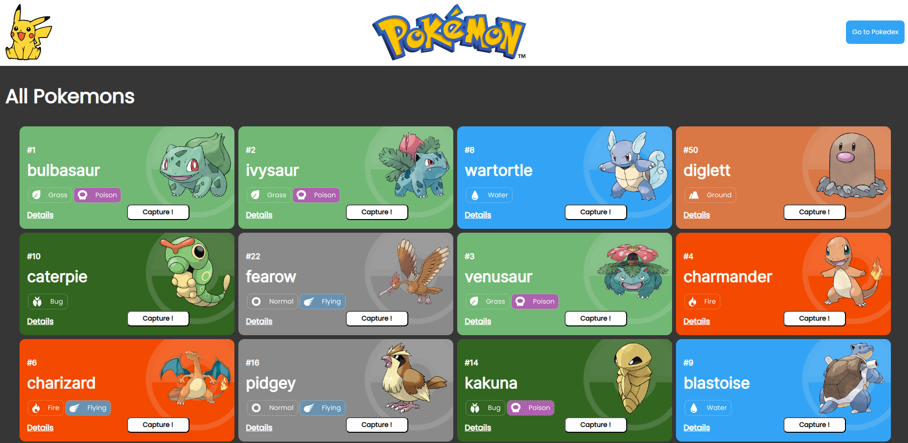

## My Pokedex-API

This is a traditional project for front-end developers, where, trought React Framework added to many libraries it was created a complete application, utilizing simple and complex structures. Here the user can navigate trought many pages and get imerged in a pokemon world, adding pokemons to his pokedex, releasing them, see their stats and others.

## Bulding the project

- JSX
- Components
- Props
- States
- Global State
- React Data Flow
- Array rendering
- Conditional Rendering
- localStorage
- React Router DOM
- useEffects
- Styled-components
- API's
- Design System

## 📄 Description
1. Home Page
    - The Main page will show a list of all available Pokemons for our application. All of these Pokemons can be added to the Pokedex clicking on the "Capture!" button.
    - All the cards show the pokemon type, along with their id, name and image.
    - The "Details" button allow us to see all the stats from the pokemon, taking the user to another route.
    - At the top of the page, on the right side, the users can access the pokedex page, where all of his pokemons will be.

2. Pokedex Page
    - At the Pokedex Page we can see all the pokemons that the user chose to capture.
    - Using LocalStorage all cards are saved; so if the user need to refresh the page, won't loose the cart.    
    - The cards functions are the same, but using conditional rendering we can see the difference between capture and release a pokemon.

3. Details Page
    - At the Details Page, the user has access to all stats of the chosen Pokemon, including HP, Attack, Defense, Speed and others .

    ## ⚒️ Technologies

  ## Deploy

  - To deploy the project it was used [Surge](https://surge.sh/)
  - Free acess to the project [My Pokedex-API](https://mypokedexlucascalabria7.surge.sh/)

## 📫 Reach me

E-mail: lucascalabria86@gmail.com

